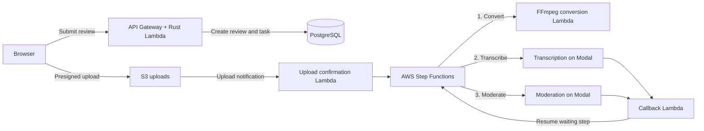

# SocialGuard

SocialGuard is an audio-moderation project built to showcase backend engineering and cloud infrastructure. It takes uploaded audio through conversion, speech transcription and AI moderation, with live progress updates along the way.

## High level summary

- **Backend:** Rust services running on AWS Lambda, with PostgreSQL and SQLx for storing jobs, transcripts and moderation results. Typed APIs use Protocol Buffers and Connect RPC.
- **Architecture:** An event-driven, serverless pipeline. Uploads land in Amazon S3 and trigger AWS Step Functions, which coordinates audio processing with FFmpeg and asynchronous model jobs.
- **AI platform:** Python services on Modal run transcription and moderation models on GPUs, sending completion callbacks back to AWS.
- **Infrastructure:** Terraform defines the AWS resources, permissions and networking. Lambda services are packaged with Docker and stored in Amazon ECR; Cloudflare provides DNS, proxying and Turnstile bot protection.
- **Reliability:** Idempotent job handling, retries, timeouts and failure recovery support the processing flow. WebSockets deliver progress events, while CloudWatch provides logs.

Together, it demonstrates more than API development: **designing, deploying and coordinating a complete distributed backend.**

## Architecture design

The design separates quick, user-facing API requests from longer-running audio and model processing. AWS handles uploads, workflow coordination and persistence, while Modal provides the GPU compute. This keeps the browser responsive without holding an HTTP request open while a model runs.

### From upload to result

1. **Create the review.** The browser submits a review through the typed API. The backend validates the request and Turnstile check, creates the review and pipeline task in PostgreSQL, and returns a short-lived, presigned S3 upload URL. An idempotency key lets an authenticated retry reuse the same submission.
2. **Upload directly to S3.** Audio goes straight from the browser to object storage rather than through the API Lambda. An S3 upload notification triggers the confirmation Lambda, which dispatches the processing workflow. Creating a review alone does not start processing.
3. **Prepare the audio.** Step Functions invokes a Rust worker that uses FFmpeg to convert and, where needed, stitch audio into a WAV artifact. Source uploads and generated artifacts live in separate S3 buckets.
4. **Run transcription, then moderation.** Rust caller Lambdas submit asynchronous jobs to the Python services on Modal. Step Functions pauses using callback task tokens while Modal coordinates CPU workers and GPU inference. Completed jobs invoke the callback Lambda, which persists the result and resumes the waiting workflow step.
5. **Finish and retrieve results.** The workflow records its final outcome. The browser receives progress notifications over WebSockets and fetches transcripts and moderation category scores through the authorized evaluation-read API.

### Clear service boundaries

Each Lambda has a focused role: submission, upload confirmation, audio processing, model dispatch, callbacks, evaluation reads or task events. Shared Rust crates own database access and lifecycle-event emission, keeping these responsibilities consistent across handlers.

The Python model services are a separate deployable, connected to Rust through explicit JSON request and callback contracts. This allows GPU dependencies and model implementations to evolve independently of the public API. Step Functions owns the processing sequence, retries and timeouts rather than hiding orchestration inside one large handler.

### Durable state and live updates

PostgreSQL stores application state, results and lifecycle-event history; S3 stores the audio itself. WebSocket frames contain event names, not transcripts or scores. Clients subscribe with a one-time ticket and can replay persisted events after reconnecting. Delivery is at-least-once, so duplicate notifications are expected rather than treated as new work.

Idempotent submission and callback handling limit duplicate effects when requests are retried. Workflow failure paths finalize failed tasks, and EventBridge terminal-execution events provide reconciliation for outcomes such as stopped or timed-out executions.

### Security and deployment

Access is scoped to each component's role: review bearer tokens authorize reads, presigned URLs grant temporary object access, and IAM policies limit AWS permissions. Modal uses OIDC to obtain temporary AWS credentials for artifact reads and callbacks instead of relying on long-lived AWS keys. Runtime secrets are supplied through SSM SecureString parameters and Modal Secrets.

Terraform defines the AWS and Cloudflare infrastructure. The deployment runner builds and publishes all eight Lambda images under one immutable version tag, then updates the infrastructure to use that version. Modal is deployed separately. Local tests include isolated PostgreSQL containers, while dedicated deployed suites exercise cloud integration boundaries.
